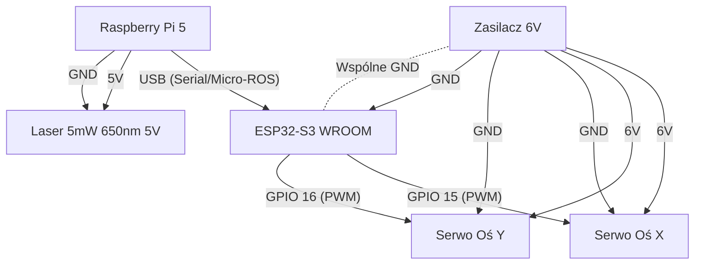

# 🤖 Bala - Robot Śledzący Obiekty (ROS 2 + Micro-ROS)

Projekt robota wykorzystującego wizję komputerową do śledzenia kolorowych obiektów (np. zielonej piłki) za pomocą kamery i serwomechanizmów. System oparty jest na architekturze hybrydowej: **Raspberry Pi 5** (mózg) oraz **ESP32-S3** (kontroler sprzętowy).

## 🚀 Funkcjonalności

- **Wykrywanie obiektów:** Analiza obrazu w czasie rzeczywistym (OpenCV) na Raspberry Pi.
- **Śledzenie:** Algorytm obliczający koordynaty obiektu i sterujący serwami, aby utrzymać obiekt w centrum kadru.
- **Komunikacja:** Micro-ROS (serial transport) łączący ROS 2 Jazzy z mikrokontrolerem.
- **Automatyzacja:** Skrypt "One-Click" do uruchamiania całego systemu.

## 🛠️ Hardware

- **Komputer:** Raspberry Pi 5 (Ubuntu 24.04)
- **Mikrokontroler:** Freenove ESP32-S3 WROOM
- **Wizja:** Raspberry Pi Camera HD v3 12MPx
- **Mechanika:** Pan-Tilt na serwomechanizmach

## 💻 Software & Wymagania

Projekt wykorzystuje specyficzną konfigurację wersji ze względu na stabilność (Hybrid Setup):

| Urządzenie | OS / Framework | Wersja ROS |
|------------|---------------|------------|
| **Raspberry Pi** | Ubuntu 24.04 | **ROS 2 Jazzy** |
| **ESP32** | PlatformIO / Arduino | **Micro-ROS Humble** |

> **Uwaga:** Agent Micro-ROS na Raspberry Pi musi być dostępny w systemie (zainstalowany w `~/microros_ws`).

## 📂 Struktura Projektu

- `esp32/` - Kod firmware dla mikrokontrolera (PlatformIO).
- `ros_ws/` - Workspace ROS 2 z pakietem percepcji (Python).
- `start_robot.sh` - Skrypt bash automatyzujący uruchamianie (Agent + Kamera).
- `bala_robot.service` - Plik usługi systemowej (dla autostartu).

## 🔌 Schemat Połączeń



## ⚙️ Instalacja

### 1. Klonowanie repozytorium
```bash
git clone [https://github.com/corki1337/bala_tracker.git](https://github.com/corki1337/bala_tracker.git)
cd bala_tracker
